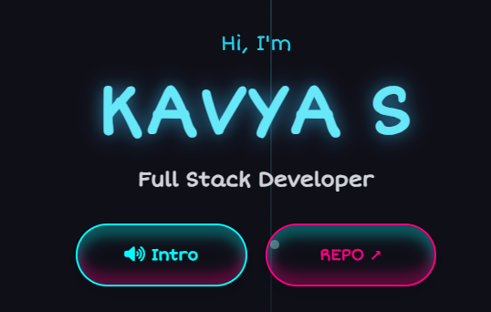

# Kavya’s Portfolio
Personal portfolio website Showcasing my journey, skills, and projects.


## Preview
**Click Here**: [Kavya’s Portfolio](https://kavyasiddportfolio.onrender.com/)
**Source Code**: [GitHub Repository](https://github.com/KavyaSiddharthan/kavya-portfolio)


**Screenshot**:


---

## Features  
- Responsive design  
- Interactive about cards  
- Animated skills section  
- Project video gallery  
- Contact form with backend  
- Draggable chatbot  

---

## Tech Stack  
**Frontend**: HTML5, CSS3, JavaScript, Tailwind CSS  
**Backend**: Node.js, Express.js, SQLite3  
**Tools**: Nodemailer, Font Awesome, Google Fonts  

---

## Installation  
1. **Clone the repository**
```bash
git clone https://github.com/KavyaSiddharthan/kavya-portfolio.git
```

2. **Install dependencies**

```bash
npm install
```

3. **Run the project**

* Development:

```bash
npm run dev
```

* Production:

```bash
npm start
```

---

## Contact

* [LinkedIn](https://www.linkedin.com/in/kavya-siddharthan)  
* [GitHub](https://github.com/KavyaSiddharthan)  
* Email: **[kavyasiddharthan7@gmail.com](mailto:kavyasiddharthan7@gmail.com)**

---

## License

This project is licensed under the **MIT License**.
